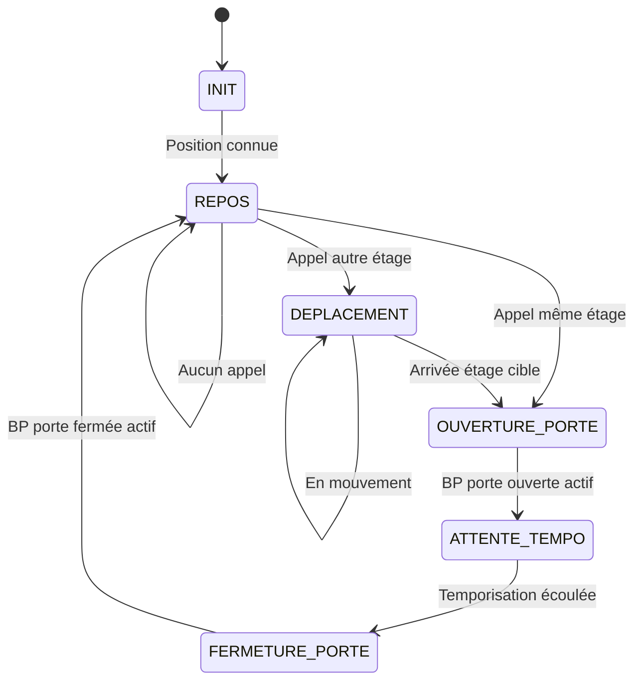

```mermaid
stateDiagram-v2
    [*] --> INIT

    INIT --> REPOS: Position connue

    REPOS --> REPOS: Aucun appel
    REPOS --> OUVERTURE_PORTE: Appel même étage
    REPOS --> DEPLACEMENT: Appel autre étage

    DEPLACEMENT --> DEPLACEMENT: En mouvement
    DEPLACEMENT --> OUVERTURE_PORTE: Arrivée étage cible

    OUVERTURE_PORTE --> ATTENTE_TEMPO: BP porte ouverte actif

    ATTENTE_TEMPO --> FERMETURE_PORTE: Temporisation écoulée

    FERMETURE_PORTE --> REPOS: BP porte fermée actif
```