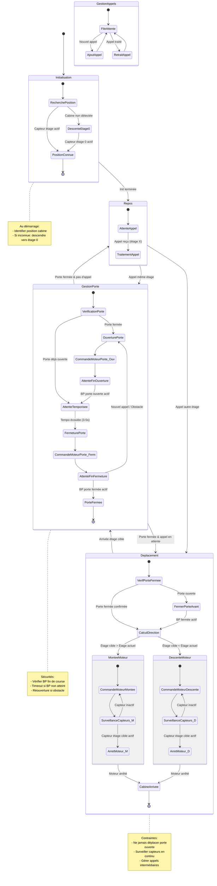

```mermaid
stateDiagram-v2
    [*] --> Initialisation

    state Initialisation {
        [*] --> RecherchePosition
        RecherchePosition --> DescenteEtage0: Cabine non détectée
        RecherchePosition --> PositionConnue: Capteur étage actif
        DescenteEtage0 --> PositionConnue: Capteur étage 0 actif
        PositionConnue --> [*]
    }

    Initialisation --> Repos: Init terminée

    state Repos {
        [*] --> AttenteAppel
        AttenteAppel --> TraitementAppel: Appel reçu (étage X)
    }

    Repos --> GestionPorte: Appel même étage
    Repos --> Deplacement: Appel autre étage

    state GestionPorte {
        [*] --> VerificationPorte
        VerificationPorte --> OuverturePorte: Porte fermée
        VerificationPorte --> AttenteTemporisee: Porte déjà ouverte
        
        OuverturePorte --> CommandeMoteurPorte_Ouv
        CommandeMoteurPorte_Ouv --> AttenteFinOuverture
        AttenteFinOuverture --> AttenteTemporisee: BP porte ouverte actif
        
        AttenteTemporisee --> FermeturePorte: Tempo écoulée (3-5s)
        
        FermeturePorte --> CommandeMoteurPorte_Ferm
        CommandeMoteurPorte_Ferm --> AttenteFinFermeture
        AttenteFinFermeture --> PorteFermee: BP porte fermée actif
        AttenteFinFermeture --> OuverturePorte: Nouvel appel / Obstacle
        
        PorteFermee --> [*]
    }

    state Deplacement {
        [*] --> VerifPorteFermee
        VerifPorteFermee --> CalculDirection: Porte fermée confirmée
        VerifPorteFermee --> FermerPorteAvant: Porte ouverte
        FermerPorteAvant --> CalculDirection: BP fermée actif
        
        CalculDirection --> MonteeMoteur: Étage cible > Étage actuel
        CalculDirection --> DescenteMoteur: Étage cible < Étage actuel
        
        state MonteeMoteur {
            [*] --> CommandeMoteurMontee
            CommandeMoteurMontee --> SurveillanceCapteurs_M
            SurveillanceCapteurs_M --> CommandeMoteurMontee: Capteur inactif
            SurveillanceCapteurs_M --> ArretMoteur_M: Capteur étage cible actif
        }
        
        state DescenteMoteur {
            [*] --> CommandeMoteurDescente
            CommandeMoteurDescente --> SurveillanceCapteurs_D
            SurveillanceCapteurs_D --> CommandeMoteurDescente: Capteur inactif
            SurveillanceCapteurs_D --> ArretMoteur_D: Capteur étage cible actif
        }
        
        MonteeMoteur --> CabineArrivee: Moteur arrêté
        DescenteMoteur --> CabineArrivee: Moteur arrêté
        CabineArrivee --> [*]
    }

    GestionPorte --> Repos: Porte fermée & pas d'appel
    GestionPorte --> Deplacement: Porte fermée & appel en attente
    Deplacement --> GestionPorte: Arrivée étage cible

    state GestionAppels {
        [*] --> FileAttente
        FileAttente --> AjoutAppel: Nouvel appel
        AjoutAppel --> FileAttente
        FileAttente --> RetraitAppel: Appel traité
        RetraitAppel --> FileAttente
    }

    note right of Initialisation
        Au démarrage:
        - Identifier position cabine
        - Si inconnue: descendre vers étage 0
    end note

    note right of GestionPorte
        Sécurités:
        - Vérifier BP fin de course
        - Timeout si BP non atteint
        - Réouverture si obstacle
    end note

    note right of Deplacement
        Contraintes:
        - Ne jamais déplacer porte ouverte
        - Surveiller capteurs en continu
        - Gérer appels intermédiaires
    end note

```