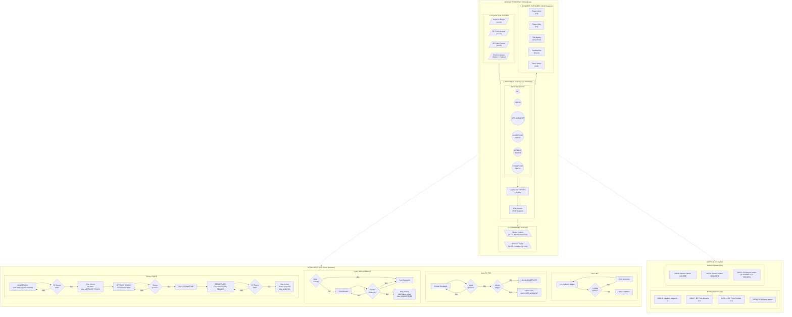

```mermaid
flowchart TB
    subgraph MAIN["BOUCLE PRINCIPALE (While Loop)"]
        direction TB
        
        subgraph ACQUISITION["1. ACQUISITION ENTRÉES"]
            direction LR
            CAP[/"Capteurs Étages<br/>(4x DI)"/]
            BPO[/"BP Porte Ouverte<br/>(4x DI)"/]
            BPF[/"BP Porte Fermée<br/>(4x DI)"/]
            APPELS[/"Boutons Appels<br/>(Paliers + Cabine)"/]
        end

        subgraph STATE_MACHINE["2. MACHINE À ÉTATS (Case Structure)"]
            direction TB
            
            subgraph CASE["État Actuel (Enum)"]
                direction LR
                E0((INIT))
                E1((REPOS))
                E2((DEPLACEMENT))
                E3((OUVERTURE<br/>PORTE))
                E4((ATTENTE<br/>TEMPO))
                E5((FERMETURE<br/>PORTE))
            end
            
            LOGIC["Logique de Transition<br/>+ Actions"]
            NEXT["État Suivant<br/>(Shift Register)"]
            
            CASE --> LOGIC
            LOGIC --> NEXT
        end

        subgraph DATA["3. DONNÉES PARTAGÉES (Shift Registers)"]
            direction LR
            SR1["Étage Actuel<br/>(U8)"]
            SR2["Étage Cible<br/>(U8)"]
            SR3["File Appels<br/>(Array Bool)"]
            SR4["État Machine<br/>(Enum)"]
            SR5["Timer Tempo<br/>(U32)"]
        end

        subgraph OUTPUTS["4. COMMANDES SORTIES"]
            direction LR
            MOT_CAB[\"Moteur Cabine<br/>(2x DO: Montée/Descente)"\]
            MOT_PORTE[\"Moteurs Portes<br/>(8x DO: 4 étages x 2 sens)"\]
        end

        ACQUISITION --> STATE_MACHINE
        DATA <--> STATE_MACHINE
        STATE_MACHINE --> OUTPUTS
    end

    subgraph DETAIL_STATES["DÉTAIL DES ÉTATS (Case Structure)"]
        direction TB
        
        subgraph CASE_INIT["Case: INIT"]
            I1["Lire capteurs étages"]
            I2{"Position<br/>connue?"}
            I3["Cmd descente"]
            I4["Aller à REPOS"]
            I1 --> I2
            I2 -->|Non| I3
            I3 --> I1
            I2 -->|Oui| I4
        end

        subgraph CASE_REPOS["Case: REPOS"]
            R1["Scruter file appels"]
            R2{"Appel<br/>présent?"}
            R3{"Même<br/>étage?"}
            R4["Aller à OUVERTURE"]
            R5["Définir cible<br/>Aller à DEPLACEMENT"]
            R1 --> R2
            R2 -->|Non| R1
            R2 -->|Oui| R3
            R3 -->|Oui| R4
            R3 -->|Non| R5
        end

        subgraph CASE_DEPLACEMENT["Case: DEPLACEMENT"]
            D1{"Cible ><br/>Actuel?"}
            D2["Cmd Montée"]
            D3["Cmd Descente"]
            D4{"Capteur<br/>cible actif?"}
            D5["Stop moteur<br/>MAJ étage actuel<br/>Aller à OUVERTURE"]
            D1 -->|Oui| D2
            D1 -->|Non| D3
            D2 --> D4
            D3 --> D4
            D4 -->|Non| D2
            D4 -->|Non| D3
            D4 -->|Oui| D5
        end

        subgraph CASE_PORTE["Cases: PORTE"]
            P1["OUVERTURE:<br/>Cmd moteur porte OUVRIR"]
            P2{"BP Ouvert<br/>actif?"}
            P3["Stop moteur<br/>Init timer<br/>Aller à ATTENTE_TEMPO"]
            P4["ATTENTE_TEMPO:<br/>Incrémenter timer"]
            P5{"Tempo<br/>écoulée?"}
            P6["Aller à FERMETURE"]
            P7["FERMETURE:<br/>Cmd moteur porte FERMER"]
            P8{"BP Fermé<br/>actif?"}
            P9["Stop moteur<br/>Retirer appel file<br/>Aller à REPOS"]
            
            P1 --> P2
            P2 -->|Non| P1
            P2 -->|Oui| P3
            P3 --> P4
            P4 --> P5
            P5 -->|Non| P4
            P5 -->|Oui| P6
            P6 --> P7
            P7 --> P8
            P8 -->|Non| P7
            P8 -->|Oui| P9
        end
    end

    subgraph IO_MAPPING["MAPPING E/S MyRIO"]
        direction LR
        subgraph DI["Entrées Digitales (DI)"]
            DI1["DIO0-3: Capteurs étages 0-3"]
            DI2["DIO4-7: BP Porte Ouverte 0-3"]
            DI3["DIO8-11: BP Porte Fermée 0-3"]
            DI4["DIO12-19: Boutons appels"]
        end
        subgraph DO["Sorties Digitales (DO)"]
            DO1["DIO20: Moteur cabine MONTÉE"]
            DO2["DIO21: Moteur cabine DESCENTE"]
            DO3["DIO22-29: Moteurs portes<br/>(4x OUVRIR + 4x FERMER)"]
        end
    end

    MAIN -.-> DETAIL_STATES
    MAIN -.-> IO_MAPPING
```