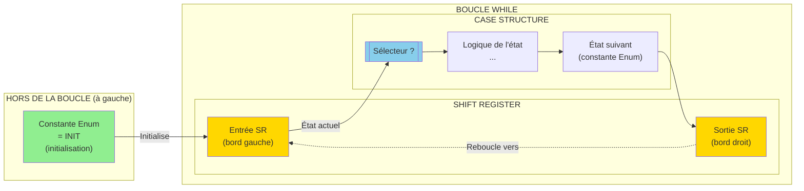

```mermaid
flowchart LR
    subgraph HORS_BOUCLE["HORS DE LA BOUCLE (à gauche)"]
        CONST_INIT["Constante Enum<br/>= INIT<br/>(initialisation)"]
    end

    subgraph BOUCLE["BOUCLE WHILE"]
        subgraph SR["SHIFT REGISTER"]
            SR_IN["Entrée SR<br/>(bord gauche)"]
            SR_OUT["Sortie SR<br/>(bord droit)"]
        end
        
        subgraph CASE["CASE STRUCTURE"]
            SEL[["Sélecteur ?"]]
            LOGIC["Logique de l'état<br/>..."]
            NEXT["État suivant<br/>(constante Enum)"]
        end
        
        SR_IN -->|"État actuel"| SEL
        SEL --> LOGIC
        LOGIC --> NEXT
        NEXT --> SR_OUT
    end

    CONST_INIT -->|"Initialise"| SR_IN
    SR_OUT -.->|"Reboucle vers"| SR_IN

    style CONST_INIT fill:#90EE90
    style SR_IN fill:#FFD700
    style SR_OUT fill:#FFD700
    style SEL fill:#87CEEB
```