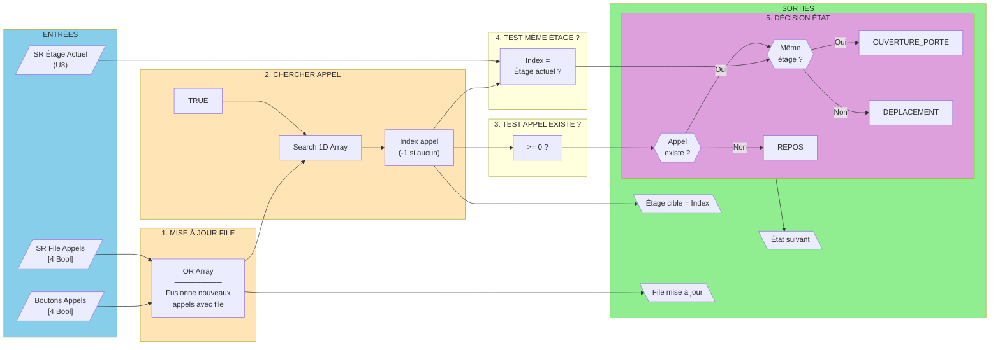

```mermaid
flowchart LR
    subgraph ENTREES["ENTRÉES"]
        BTN[/"Boutons Appels<br/>[4 Bool]"/]
        SR_FILE[/"SR File Appels<br/>[4 Bool]"/]
        SR_ETAGE_ACT[/"SR Étage Actuel<br/>(U8)"/]
    end

    subgraph MAJ_FILE["1. MISE À JOUR FILE"]
        OR_ARRAY["OR Array<br/>─────────<br/>Fusionne nouveaux<br/>appels avec file"]
        
        BTN --> OR_ARRAY
        SR_FILE --> OR_ARRAY
    end

    subgraph CHERCHE["2. CHERCHER APPEL"]
        TRUE_C["TRUE"]
        SEARCH["Search 1D Array"]
        INDEX["Index appel<br/>(-1 si aucun)"]
        
        OR_ARRAY --> SEARCH
        TRUE_C --> SEARCH
        SEARCH --> INDEX
    end

    subgraph TEST_APPEL["3. TEST APPEL EXISTE ?"]
        CMP_EXIST[">= 0 ?"]
        INDEX --> CMP_EXIST
    end

    subgraph TEST_MEME["4. TEST MÊME ÉTAGE ?"]
        CMP_EGAL["Index =<br/>Étage actuel ?"]
        INDEX --> CMP_EGAL
        SR_ETAGE_ACT --> CMP_EGAL
    end

    subgraph DECISION["5. DÉCISION ÉTAT"]
        direction TB
        
        CASE_EXT{{"Appel<br/>existe ?"}}
        CASE_INT{{"Même<br/>étage ?"}}
        
        E_REPOS["REPOS"]
        E_OUV["OUVERTURE_PORTE"]
        E_DEPL["DEPLACEMENT"]
        
        CMP_EXIST --> CASE_EXT
        CMP_EGAL --> CASE_INT
        
        CASE_EXT -->|Non| E_REPOS
        CASE_EXT -->|Oui| CASE_INT
        CASE_INT -->|Oui| E_OUV
        CASE_INT -->|Non| E_DEPL
    end

    subgraph SORTIES["SORTIES"]
        OUT_ETAT[\"État suivant"\]
        OUT_CIBLE[\"Étage cible = Index"\]
        OUT_FILE[\"File mise à jour"\]
        
        DECISION --> OUT_ETAT
        INDEX --> OUT_CIBLE
        OR_ARRAY --> OUT_FILE
    end

    style ENTREES fill:#87CEEB
    style SORTIES fill:#90EE90
    style MAJ_FILE fill:#FFE4B5
    style CHERCHE fill:#FFE4B5
    style DECISION fill:#DDA0DD
```