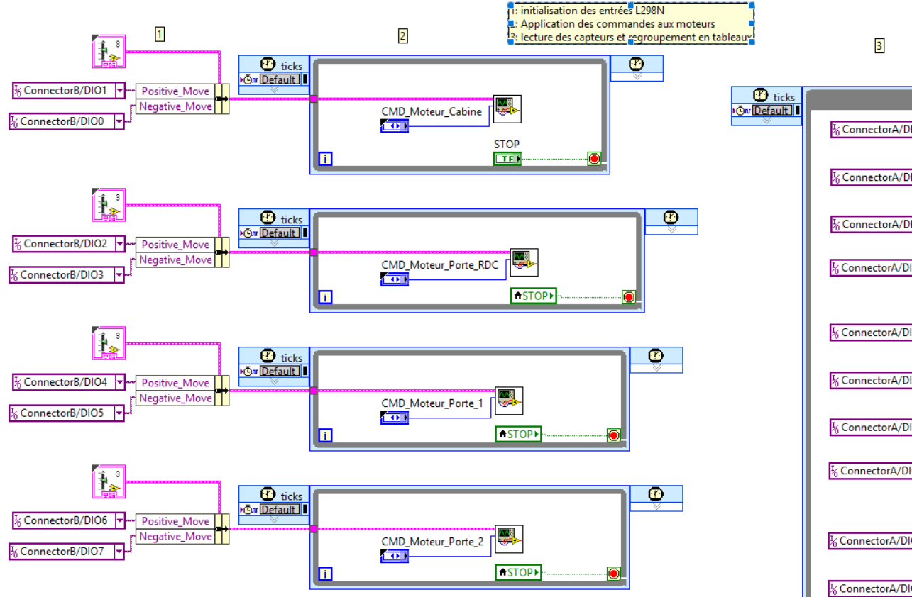
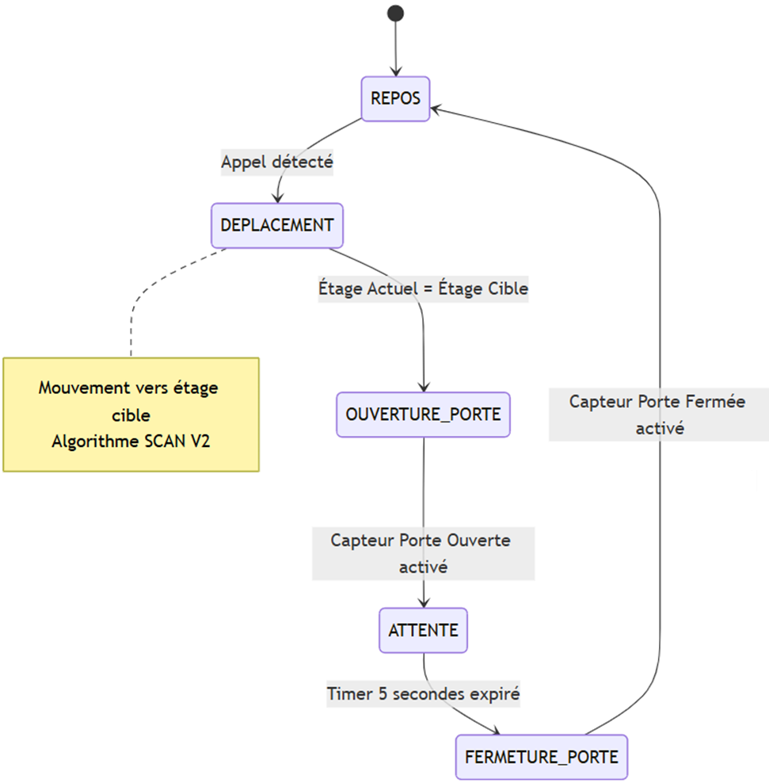

# 🛗 Contrôle-Commande d'Ascenseur Didactique (ASC89)
[**👉 Cliquez ici pour consulter le Rapport Technique Complet (PDF)**](Code/labview/livrables/YOVO_PSCM_A25_Rapport_Technique_Ascenseur_LabVIEW_UTBM.pdf)

**Auteur :** Yawo Emmanuel YOVO  
**Master :** Ingénierie des Systèmes Complexes - Spécialisation Mécatronique  
**Université :** UTBM (Université de Technologie de Belfort-Montbéliard)  
**Année :** 2026

---

## 📋 Contexte et Objectifs

Ce projet vise à concevoir et implémenter le système de contrôle-commande d'une maquette d'ascenseur didactique à 4 niveaux. L'architecture repose sur une cible embarquée **NI myRIO-1900** utilisant une approche hybride **FPGA / Processeur Temps Réel (RT)**.

### Objectifs Techniques
* Gérer des événements asynchrones (appels couloir/cabine) sans perte d'information.
* Assurer la sécurité du système (arrêt immédiat si porte ouverte).
* Implémenter un algorithme de gestion de trafic optimisé (SCAN V2).
* Démontrer une architecture logicielle modulaire et découplée.

---

## 🛠 Architecture Matérielle

Le système s'interface avec la maquette **ASC89** composée de :
* **Actionneurs :** 1 Moteur Treuil (Cabine) + 4 Moteurs Portes (CC 12V).
* **Capteurs :** 16 Capteurs TOR (Micro-switchs) pour la détection de présence cabine et les fins de course portes.
* **Puissance :** Drivers **L298N** (Double Pont-H) pour l'interface 12V/Logic 3.3V.

---

## 💻 Architecture Logicielle (LabVIEW)

Le projet utilise le pattern de conception **Maître/Esclave Découplé**.

### 1. Couche FPGA (Bas Niveau)
Elle agit comme une **HAL (Hardware Abstraction Layer)**. Elle s'exécute à 40 MHz sur le FPGA du myRIO.
* **Lecture parallèle :** Scrutine les 16 entrées numériques en continu.
* **Sécurité :** Génère les signaux PWM et gère l'inversion de polarité via le driver L298N hardware.
* **Découplage :** Fonctionne indépendamment du processeur RT (si le processeur plante, le FPGA continue d'assurer les états électriques).

*Figure : Boucles parallèles du FPGA (Lecture Capteurs à droite, Commande Moteurs à gauche).*

### 2. Couche Real-Time (Haut Niveau)
Hébergée sur le processeur ARM Cortex-A9, elle exécute la logique décisionnelle via une **Machine à États (State Machine)**.

**Cycle de fonctionnement :**
1.  **Read Inputs :** Lecture des données brutes depuis le FPGA et l'IHM.
2.  **Logic :** Algorithme SCAN et transitions d'états (Repos, Déplacement, Ouverture...).
3.  **Write Outputs :** Envoi des commandes de mouvement vers le FPGA.

*Figure : Cœur de la machine à états avec le registre à décalage (Cluster).*

---

## 📂 Organisation du Code

L'architecture est modulaire. Les données transitent via un **Cluster Strict TypeDef** pour faciliter la maintenance.

### Modules Principaux (Handlers)
* `Init_Handler.vi` : Initialisation des variables et références FPGA.
* `Read_Inputs.vi` : Centralisation des capteurs physiques et virtuels.
* `Calculateur_Destination.vi` : Cerveau de l'algorithme SCAN V2.
* `Deplacement_Handler.vi` : Asservissement en position (étage par étage).
* `Gestion_Voyant.vi` : Feedback visuel sur l'IHM.

### Gestion des Données
Toutes les variables d'état (Position, Appels, Direction) sont encapsulées dans un cluster unique.

---

## 🚀 Installation et Déploiement

### Prérequis
* **Logiciel :** LabVIEW 2019 (ou supérieur).
* **Modules :** LabVIEW Real-Time, LabVIEW FPGA, Driver NI-RIO.
* **Matériel :** NI myRIO-1900 connecté en USB ou Wi-Fi.

### Instructions
1.  Cloner ce dépôt.
2.  Ouvrir le projet `Ascenseur_Controller.lvproj`.
3.  **Compiler le FPGA :** Ouvrir `FPGA_Main.vi` (Cible FPGA) et lancer la compilation (Bitfile).
4.  **Exécuter le RT :** Ouvrir `Main.vi` (Cible RT) et cliquer sur *Run*.

---

## ⚙️ Détails du Câblage (Mémo)

| Composant | Port myRIO | Pins |
| :--- | :--- | :--- |
| **Capteurs TOR** | MXP A | DIO0 à DIO15 |
| **Moteurs** | MXP B | DIO0 à DIO9 |

> **Note :** Les cavaliers (jumpers) des drivers L298N sont en place (Mode Enable High). La vitesse est constante, seul le sens est piloté.

---

## 📈 Perspectives

* [ ] Création d'un PCB "Shield" pour supprimer les câbles volants.
* [ ] Ajout d'une régulation PWM pour gérer des rampes d'accélération/décélération.
* [ ] Intégration d'un écran LCD I2C pour l'affichage de l'étage sur la maquette.

---

*Projet réalisé à l'UTBM - Département Mécatronique*

